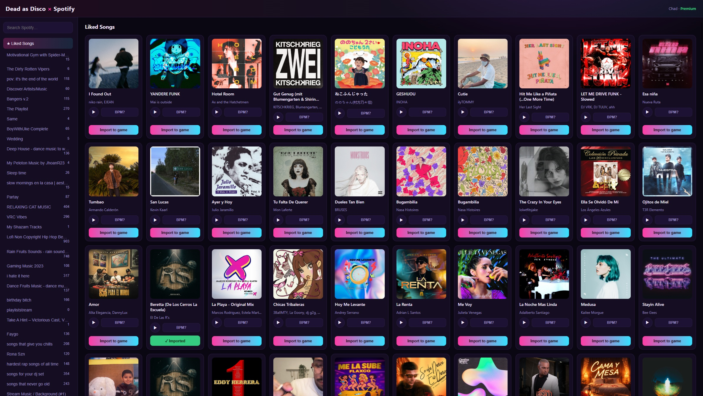

# Dead as Disco × Spotify

Browse your Spotify, preview a track, click once, and it's **imported into Dead as
Disco** as a ready-to-play custom song — with auto-detected BPM.



> **It's all local.** This is a small web app that runs entirely on *your own computer*
> — the "server" is just `python app.py` on your machine. Your Spotify login and the
> import all stay local. Nothing is sent to anyone, there's no cloud account, and no
> data leaves your PC.

```
Browse Spotify  ->  pick a track  ->  ▶ preview / see BPM  ->  Import to game
        ->  bring the track in via librespot (Spotify Premium)
        ->  prepare it as Audio.ogg @ 44.1kHz (ffmpeg)
        ->  estimate tempo (librosa)
        ->  write  %LOCALAPPDATA%\Pagoda\Saved\ImportedSongs\<Title - Artist>\
                       Audio.ogg + Meta.json
```

> Personal use. Requires **Spotify Premium**. Spotify changes things often, so the
> import step is the part most likely to need a library update over time.

---

## Prerequisites

- **Python 3.11+** (tested on 3.13)
- **ffmpeg / ffprobe** on your PATH — check with `ffmpeg -version`
  (Windows: `winget install Gyan.FFmpeg`, or grab a build and add it to PATH)
- **Spotify Premium**
- A free **Spotify app** for the Web API (browse/search) — 2-minute setup below
- **Dead as Disco** installed (the game must have been run at least once)

---

## Setup

1. **Install dependencies**

   ```bash
   pip install -r requirements.txt
   ```
   (Heads up: `librosa` is a large install and may take a few minutes the first time.)

2. **Register a Spotify app** — this is only for browsing your library:
   - Go to <https://developer.spotify.com/dashboard> → **Create app** (name it anything).
   - In the app's **Settings → Edit**, add this exact **Redirect URI**, then click
     **Add** and **Save**:
     ```
     http://127.0.0.1:8765/callback
     ```
     ⚠️ It must be `127.0.0.1`, not `localhost` — Spotify rejects `localhost`.
   - Copy the **Client ID** and **Client Secret**.

3. **Create your config**

   ```bash
   cp config.example.json config.json
   ```
   Open `config.json` and paste in your Client ID and Client Secret.

4. **Run**

   ```bash
   python app.py
   ```
   Your browser opens to the app.
   - First run: click **Connect Spotify** to authorise browsing. On your first
     **preview** or **import**, you'll authorise with your **Premium** account once.
     Both logins are cached, so later runs are silent.

5. **In the game:** after importing, **restart Dead as Disco** (or back out of and
   re-enter the song-select screen) so it re-scans and shows your new songs.

---

## Using it

- **Sidebar** — your playlists + Liked Songs. **Search box** — search all of Spotify.
- **▶ (play)** — preview a track (plays the full song). The first play of a song takes a
  couple seconds to load, then it's cached so importing is instant.
- **BPM?** — estimate the tempo (also fills in automatically when you preview).
- **Import to game** — prepares the track and writes it into the game. Already-imported
  songs show a green ✓ badge.

If a song's beat feels slightly off in game, recalibrate it on the in-game **BPM
calibration** screen — the auto-estimate is a starting point; manual calibration wins.

---

## Config options (`config.json`)

| Key | Meaning |
|-----|---------|
| `spotify_client_id` / `spotify_client_secret` | Your Spotify app credentials (Web API) |
| `spotify_redirect_uri` | Must match the app's redirect URI exactly |
| `imported_songs_dir` | Override the game's ImportedSongs path (blank = auto-detect `%LOCALAPPDATA%\Pagoda\...`) |
| `port` | Local web server port (default 8765). If you change it, update the redirect URI too. |
| `ogg_quality` | libvorbis quality 0–10 when re-encoding (default 8) |
| `auto_tempo` | Estimate BPM with librosa (true) or always use `default_tempo` (false) |
| `default_tempo` | Fallback BPM if estimation is off/unavailable |
| `overwrite_existing` | Re-import songs that are already in the game |

---

## Project layout

| File | Role |
|------|------|
| `app.py` | Flask server + routes; OAuth callback; opens the browser |
| `spotify_client.py` | Spotify Web API (playlists, liked, search, metadata) |
| `audio_grabber.py` | librespot login + track retrieval (with timeout) — Premium |
| `tempo.py` | librosa BPM estimation with octave correction |
| `importer.py` | retrieve → ffmpeg → tempo → write `ImportedSongs/<song>/` |
| `game_paths.py` | locate the game's ImportedSongs folder |
| `config.py` | load `config.json` |
| `templates/`, `static/` | the browser UI |

Files that are **never** committed (gitignored, personal): `config.json`,
`credentials.json`, `.spotipy_cache`, `cache/`.

---

## Troubleshooting

- **`INVALID_CLIENT: Invalid redirect URI`** — the redirect URI in your Spotify
  dashboard doesn't exactly match `http://127.0.0.1:8765/callback`. Use `127.0.0.1`
  (not `localhost`), click **Add** then **Save**.
- **Badge says no Premium but you have it** — make sure you approved the latest
  permission prompt; delete `.spotipy_cache` and reconnect.
- **Import times out (~90s)** — that track isn't available to stream (region-locked or
  not playable on Spotify Connect). Try a different version/release of the song.
- **A song doesn't appear in game** — restart the game (or re-enter song select); it
  only scans the folder on entry/startup.
- **Login fails** — Spotify occasionally changes its auth. Delete `credentials.json`
  and retry; update the `librespot` package if needed.
- **Imported song crashes the game on load** — confirm it's 44.1kHz:
  `ffprobe "…/ImportedSongs/<song>/Audio.ogg"` (the tool prepares it at 44.1kHz to avoid
  the game's 48kHz crash).

---

## License

[MIT](LICENSE).

[librespot]: https://github.com/librespot-org/librespot
